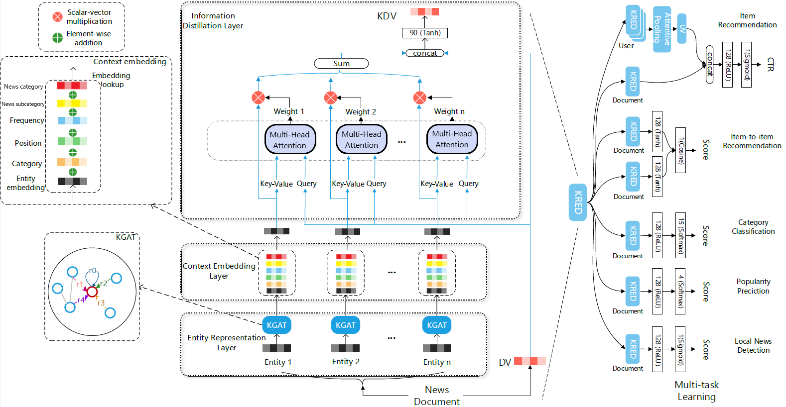

## Introduction

This repository proposes two extensions to the implementation of [KRED: Knowledge-Aware Document Representation for News Recommendations](https://arxiv.org/abs/1910.11494)

## Model description

KRED is a knowledge enhanced framework which enhance a document embedding with knowledge information for multiple news recommendation tasks. The framework mainly contains two part: representation enhancement part(left) and multi-task training part(right).

Two extensions to this model have been implemented:
- replacing the attention layer over the entities with a multi-head attention layer;
- adding to the context embedding layer the embedding of the news category which consists of a first general category and a second more specific category, the two categories are embedded separately.

The multi-head attention, the embedding of the first news category and the embedding of the second news embedding can be enabled/disabled using the config.

##  Data description:

We use [MIND dataset](https://msnews.github.io) in this repo, in particular the experiments were performed using MINDsmall dataset containing 50k users from MINDlarge dataset due to the hardware limitations.

##  Running the code

Follow the instructions in the notebook kred_example.ipynb

## Environment
The code has been tested using the Google Colab environment, running under Python 3.8.10, with the following packages installed (along with their dependencies):
- numpy==1.21.6
- scikit-learn==1.0.2
- scipy==1.7.3
- torch==1.13.1
- sentence_transformers==2.2.2
